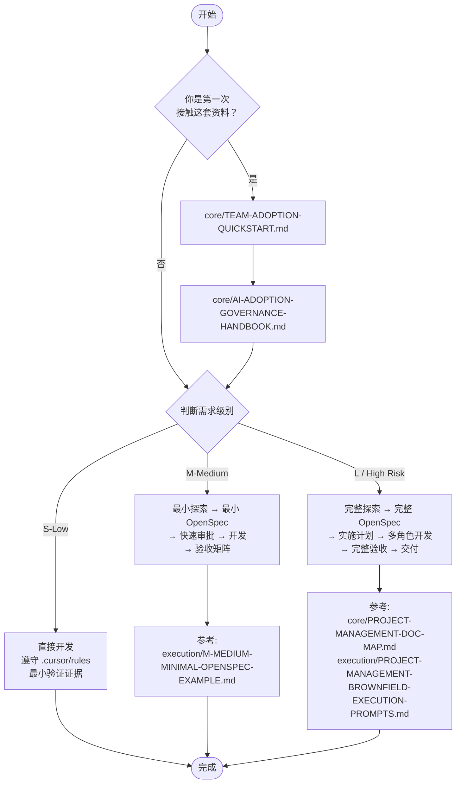

# AI 编程落地一页纸速查卡

> 用途：给团队成员一张不超过一页纸的速查卡，30 秒找到应该读什么、该走哪条路径。  
> 使用场景：培训发放、新人入职、贴在工位旁。

---

## 阅读路径全景图



---

## 按角色：你该先读哪 3 份

| 角色 | 第 1 份 | 第 2 份 | 第 3 份 |
|---|---|---|---|
| **TL / 架构师** | `core/AI-ADOPTION-GOVERNANCE-HANDBOOK.md` | `execution/PROJECT-MANAGEMENT-OPENSPEC-SUPERPOWERS-SPEC-GUIDE.md` | `execution/BROWNFIELD-RULE-BASELINE-PLAYBOOK.md` |
| **后端开发** | `core/AI-ADOPTION-GOVERNANCE-HANDBOOK.md` | `execution/BROWNFIELD-AI-PROMPT-HANDBOOK.md` | `execution/PROJECT-MANAGEMENT-BROWNFIELD-EXECUTION-PROMPTS.md` |
| **前端开发** | `core/AI-ADOPTION-GOVERNANCE-HANDBOOK.md` | `execution/BROWNFIELD-AI-PROMPT-HANDBOOK.md` | `execution/PROJECT-MANAGEMENT-BROWNFIELD-EXECUTION-PROMPTS.md` |
| **测试 / 验收** | `core/AI-ADOPTION-GOVERNANCE-HANDBOOK.md` | `execution/BROWNFIELD-FEATURE-ACCEPTANCE-MATRIX.md` | `execution/BROWNFIELD-DELIVERY-TEMPLATE.md` |
| **产品经理** | `core/TEAM-ADOPTION-QUICKSTART.md` | `core/AI-ADOPTION-GOVERNANCE-HANDBOOK.md` | `execution/PROJECT-MANAGEMENT-BROWNFIELD-PRACTICAL-CASE.md` |

---

## 三条路径速查

### S-Low（微小且低风险）

```
判断标准：单字段修正、文案调整、明确边界的样式微调
硬性排除：涉及权限/租户/导出语义/旧接口契约/事务边界
流    程：.cursor/rules → 直接实现 → 最小验证证据 → PR
```

### M-Medium（中型且风险可控）

```
判断标准：标准 CRUD、独立页面新增、标准 API 对接
流    程：最小探索 → @openspec-ff-change → 人工审批（≤4h）→ 开发 → 验收矩阵 → PR
升级条件：边界不清 / 字段契约不清 / 主数据来源不清 → 升级为 L
```

### L / High Risk（大型或高风险）

```
判断标准：多租户、权限改造、核心资产调整、跨模块联动、高敏感业务
流    程：完整探索 → 完整 OpenSpec → 实施计划 → 多角色开发 → 联调 → 验收矩阵 → 交付模板 → 发布门禁
```

---

## 三条铁律

1. **AI 不能自证完成** — "我本地测过了""AI 说通过了"不算完成，必须有结构化证据
2. **先理解现状再动手** — 棕地项目里不允许跳过探索直接进入设计和实现
3. **规则是基础设施** — `.cursor/rules` 默认消费，不是每次需求都重新提炼

---

## 统一推荐起手顺序（所有角色通用）

| 顺序 | 文档 | 一句话说明 |
|---|---|---|
| 1 | `core/TEAM-ADOPTION-QUICKSTART.md` | 最短推广入口 |
| 2 | `core/AI-ADOPTION-GOVERNANCE-HANDBOOK.md` | 治理总手册，判断走哪条路径 |
| 3 | `core/BROWNFIELD-AI-DEVELOPMENT-INDEX.md` | 流程入口页，按场景导航 |
| 4 | `execution/AI-WORKFLOW-TOOLING-PREREQUISITES.md` | 工具环境确认 |
| 5 | `core/PROJECT-MANAGEMENT-DOC-MAP.md` | 主案例导航 |
| 6 | `execution/PROJECT-MANAGEMENT-BROWNFIELD-PRACTICAL-CASE.md` | 主案例实战 |
| 7 | `execution/BROWNFIELD-FEATURE-ACCEPTANCE-MATRIX.md` | 验收矩阵 |

