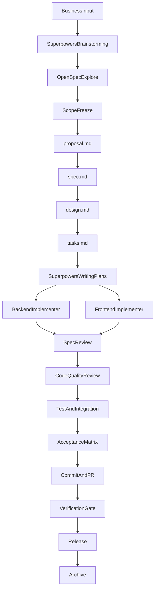

# 项目管理模块企业实战 Spec 指导

> 文档日期：2026-03-27  
> 适用项目类型：`Java + Spring Boot` 后端，`Vue 3 + Vite` 前端  
> 目标读者：产品经理、架构师、后端负责人、前端负责人、AI 协作开发负责人  
> 使用边界：本文主要解释完整方法为什么成立、关键产物之间如何衔接，不直接替代治理分流手册、执行提示词手册、验收矩阵和交付模板。

---

## 1. 文档目标

本文档给出一套可按步骤落地的企业实战方法，用“项目管理模块”作为案例，演示如何把一个棕地项目功能从需求分析推进到：

1. 形成正式规格；
2. 落地为前后端设计；
3. 拆成可执行计划；
4. 通过多角色协作完成开发、验证、部署与归档。

本文档重点回答四个问题：

1. `OpenSpec` 和 `Superpowers` 如何衔接；
2. 棕地项目为什么必须先 `opsx-explore`；
3. 前后端设计如何沉淀成可验证 spec；
4. 如何通过测试、验收矩阵、PR 与发布闭环判断功能是否具备交付条件；
5. 什么场景应走完整流程，什么场景应走治理快车道。

在使用本文档前，建议先补看：

1. `knowledge/core/AI-ADOPTION-GOVERNANCE-HANDBOOK.md`
2. `knowledge/core/PROJECT-MANAGEMENT-DOC-MAP.md`
3. `knowledge/execution/AI-WORKFLOW-TOOLING-PREREQUISITES.md`

因为本文档主要解释的是“完整方法如何成立”，而不是代替治理手册去做所有需求的分流判断，也不是直接替代执行提示词手册去推进开发。

---

## 2. 案例定义

为了让方法真正贴近企业实战，本文统一使用“项目管理模块”作为主案例。默认范围如下：

1. 列表查询；
2. 新增项目；
3. 修改项目；
4. 导出当前筛选结果。

默认约束如下：

1. 必须复用现有权限体系；
2. 必须复用现有租户隔离；
3. 必须复用现有字典或主数据来源；
4. 必须复用现有导出能力；
5. RP 原型或设计稿只作为 UI 输入，不直接等于实现方案。

明确不做：

1. 全新系统重建；
2. 无关大规模重构；
3. 脱离现有组件体系重做前端；
4. 未经过规格回写的临时需求扩张。

---

## 3. 核心原则

## 3.1 真相源只保留一份

在企业协作里，最常见的问题不是“不会写文档”，而是“同一件事写出三套互相冲突的文档”。本案例统一采用以下原则：

1. `Superpowers:brainstorming` 负责前期澄清，不作为最终规格真相源；
2. 在当前 `change` 范围内，`OpenSpec change` 目录下的 `proposal.md`、`spec.md`、`design.md`、`tasks.md` 作为正式需求和设计真相源；
3. `Superpowers:writing-plans` 产出的实施计划是执行真相源；
4. 仓库代码、测试结果、验收矩阵和 PR 说明是交付真相源。

当这些产物之间发生冲突时，优先级建议固定为：

1. 当前已确认并更新的 `OpenSpec artifacts`
2. 与之同步后的实施计划
3. 当前实现与验证证据

一句话原则：

> 如果实施计划和 OpenSpec 冲突，以 OpenSpec 为准，并立即回写或重新生成实施计划。  

## 3.2 OpenSpec 管“做什么”，Superpowers 管“怎么高质量做”

建议按下面的职责边界执行：

| 工具 | 主要职责 | 输出 |
|---|---|---|
| `Superpowers:brainstorming` | 澄清问题、比较方案、收敛范围 | 需求结论、边界、推荐方案 |
| `/opsx-explore` | 勘探棕地现状、识别复用点和风险 | 现状地图、风险点、待确认问题 |
| `OpenSpec` | 把需求固化成正式 change | `proposal` / `spec` / `design` / `tasks` |
| `Superpowers:writing-plans` | 把 OpenSpec 任务展开成工程实施计划 | `implementation plan` |
| `Superpowers:subagent-driven-development` | 多角色执行、评审、修正 | 实现结果、审查反馈 |
| `/opsx-verify` + `verification-before-completion` | 交付前核验 | 完整性/正确性/一致性验证 |
| Git / PR / Merge | 工程收口与评审 | commit、PR、review、merge 结论 |
| 验收矩阵 + 发布清单 | 判断是否具备进入发布评审条件 | 达标结论、上线证据 |

## 3.3 棕地项目的基本纪律

1. 在不了解现状前，不允许直接进入设计实现模式；
2. 在没有正式 change 前，不允许把口头需求当成最终真相源；
3. 在没有验证证据前，不允许宣称“功能完成”；
4. 在开发中发现需求遗漏时，先回写 `OpenSpec`，再继续开发。

## 3.4 工具前置与 fallback

这套流程默认你可以使用：

1. `/opsx-explore`
2. `/opsx-verify`
3. `/opsx-sync`
4. `/opsx-archive`
5. `Superpowers:brainstorming`
6. `Superpowers:writing-plans`
7. `Superpowers:subagent-driven-development`

如果当前环境无法直接使用这些能力，不要假装“已经执行过”。  
请直接参考：

- `knowledge/execution/AI-WORKFLOW-TOOLING-PREREQUISITES.md`

并按其中的 fallback 方式降级执行。

## 3.5 AI 能力边界

为了避免把 AI 输出误当成事实，本方法默认遵守以下边界：

1. AI 可以帮助整理需求、抽取模式、生成草案和检查一致性，但不能替代业务确认；
2. AI 可以基于代码与文档总结“当前观察结论”，但不能在没有证据时假装知道真实链路；
3. RP、设计稿、接口样例都只能作为输入线索，不能自动等于最终实现真相；
4. “具备上线评审条件”“可归档”“已达标”都必须以验证证据和人工确认作为最后门禁。

## 3.6 流程分流原则

不是所有需求都应该直接套用本文档的完整流程。  
正式执行前，应先按：

- `knowledge/core/AI-ADOPTION-GOVERNANCE-HANDBOOK.md`

判断当前需求属于哪条治理路径。

建议口径如下：

1. `S-Low`：微小且低风险需求，不默认进入完整 OpenSpec 重流程；
2. `M-Medium`：中型且风险可控需求，优先走“最小探索 + 最小 OpenSpec + 快速审批”；
3. `L / High Risk`：大型或高风险需求，使用本文档描述的完整方法最合适。

一句话说：

> 本文档主要服务于 `L / High Risk` 场景，也可为 `M-Medium` 提供方法论参考，但不应成为所有需求的默认入口。

---

## 4. 完整流程总览

在治理层里，这条流程默认对应：

1. `L / High Risk` 需求；
2. 或者在 `M-Medium` 审批中被升级为高风险的需求。



推荐顺序：

1. `Superpowers:brainstorming`
2. `/opsx-explore`
3. `OpenSpec proposal/spec/design/tasks`
4. `Superpowers:writing-plans`
5. `Superpowers:subagent-driven-development`
6. 测试、联调、验收矩阵
7. Git commit、code review、PR、merge
8. `/opsx-verify`
9. 发布准备、上线、归档

## 4.1 `M-Medium` 快车道与完整流程的关系

对于 `M-Medium` 需求，不建议一上来完整展开本文档全部阶段。  
更推荐：

1. 最小探索；
2. 最小 OpenSpec；
3. 快速人工审批；
4. 审批通过后开发；
5. 保留验收矩阵和结构化证据。

只有在以下情况出现时，再升级到本文完整流程：

1. 边界不清；
2. 主数据来源不清；
3. 旧链路影响超出预期；
4. 验证项明显不足；
5. 风险高于原先评估。

---

## 5. 阶段一：需求澄清

本阶段目标不是“写文档”，而是把模糊需求收敛成可写规格的输入。

## 5.1 本阶段输入

通常只有这些：

1. “新增一个项目管理模块”；
2. 一份 RP 链接或设计稿；
3. 若干字段说明；
4. 业务方零散口头约束。

## 5.2 本阶段输出

1. 业务目标；
2. 目标用户；
3. MVP 范围；
4. 非目标；
5. 兼容性约束；
6. 非功能约束；
7. 推荐实施边界。

## 5.3 推荐提问顺序

企业场景下，建议按下面顺序一问一答，不要一次扔十几个问题：

1. 为什么做项目管理模块；
2. 第一批用户是谁；
3. 列表查询要支持哪些字段；
4. 新增和修改字段是否一致；
5. 导出是否按当前筛选条件生效；
6. 权限、租户、字典、主数据来源有哪些现成约束；
7. 哪些旧行为不允许变化；
8. 上线方式、灰度和回滚要求是什么。

## 5.4 推荐提示词

```text
你现在扮演企业项目中的需求澄清助手。请围绕“项目管理模块”功能，按一次只问一个问题的方式帮助我收敛需求。

已知范围：
1. 列表查询
2. 新增
3. 修改
4. 导出

你的目标：
1. 识别业务目标；
2. 明确目标用户；
3. 收敛 MVP 范围；
4. 列出非目标；
5. 识别兼容性和非功能约束；
6. 在信息足够后，给出 2-3 个实现路径，并推荐一个最适合当前棕地项目的方向。

要求：
1. 一次只问一个问题；
2. 优先问兼容性、主数据、导出和旧链路影响；
3. 不要直接开始设计数据库或接口；
4. 在需求不明确前，不要进入实现建议。
```

---

## 6. 阶段二：为什么必须先 `opsx-explore`

在棕地项目里，探索不是可选项，而是第一道工程闸门。

## 6.1 探索目标

至少要回答：

1. 系统里是否已有相近模块；
2. 前端哪些页面、路由、组件、API 封装可复用；
3. 后端哪些 Controller、Service、Mapper、表结构可复用；
4. 字段的真实主数据来源是什么；
5. 导出、权限、租户、日志能力是否已有统一实现；
6. 新功能最可能破坏哪些旧链路。

## 6.2 推荐提示词

```text
请先进入棕地项目探索模式，不要设计新功能，也不要写代码。我要在这个历史项目中新增“项目管理模块”，功能包括：
1. 列表查询
2. 新增
3. 修改
4. 导出

请重点找出：
1. 系统里是否已有相近模块；
2. 前端相关页面入口、路由、共享表格、共享表单、共享导出组件；
3. 后端相关 Controller、Service、Mapper、表结构、导出工具、权限和租户逻辑；
4. 项目状态、负责人、客户等字段是否已有字典或主数据来源；
5. 列表查询、新增、修改、导出分别最可能复用哪些旧模块；
6. 本次新增最可能破坏哪些旧链路；
7. 还缺哪些信息必须向业务确认。

输出要求：
1. 先输出“现状地图”；
2. 再输出“复用候选点”；
3. 再输出“高风险点”；
4. 最后输出“待确认问题”；
5. 每条核心结论至少附一个真实文件路径或代码落点；
6. 至少给出一条真实调用链、依赖链或页面到接口链；
7. 对不确定内容明确标记为 `待确认`；
8. 不给实现代码。
```

## 6.3 探索完成标准

至少应拿到：

1. 前端复用地图；
2. 后端复用地图；
3. 旧链路风险清单；
4. 主数据来源说明；
5. 待确认问题清单；
6. 关键结论对应的真实文件路径证据；
7. 至少一条关键调用链证据。

---

## 7. 阶段三：用 OpenSpec 固化正式规格

本阶段把需求和探索结果写进 OpenSpec，形成正式 change。

## 7.1 推荐 capability

本案例建议统一使用：

- `project-management`

## 7.2 proposal 的作用

`proposal.md` 回答：

1. 为什么做；
2. 本次范围是什么；
3. 影响哪些旧页面、旧接口、旧数据结构；
4. 非目标是什么；
5. 风险和兼容边界是什么。

## 7.3 spec 的作用

`spec.md` 回答：

1. 系统必须具备哪些业务能力；
2. 每条 requirement 对应哪些 scenario；
3. 前后端共同的验收标准是什么；
4. 哪些兼容性行为必须保留。

建议 requirement 至少覆盖：

1. `Query Project List`
2. `Create Project`
3. `Update Project`
4. `Export Project List`

## 7.4 design 的作用

`design.md` 回答：

1. 复用哪些现有模块；
2. 为什么采用当前实现路径；
3. 前后端边界如何划分；
4. 字典、主数据、权限、租户如何接入；
5. 字段级请求/响应契约如何对齐；
6. 测试、回滚、发布策略如何设计。

## 7.5 tasks 的作用

`tasks.md` 是 OpenSpec 和 Superpowers 的衔接桥梁，推荐按下面分组：

1. `Brownfield Discovery`
2. `Backend List Query`
3. `Backend Create/Update`
4. `Backend Export`
5. `Frontend List Page`
6. `Frontend Form`
7. `Frontend Export`
8. `Integration`
9. `Verification`
10. `Release Preparation`

## 7.6 推荐 OpenSpec 提示词

```text
请基于以下需求，为变更 `project-management` 生成完整的 OpenSpec 产物。

项目背景：
- 后端：Java + Spring Boot
- 前端：Vue 3 + Vite
- 场景：棕地项目中的项目管理模块新增

已确认范围：
- 列表查询
- 新增
- 修改
- 导出当前筛选结果

已知约束：
- 必须复用现有权限、租户、导出、字典和主数据来源
- 必须兼容旧页面、旧接口和旧数据结构

请生成时遵循以下要求：
1. proposal 强调为什么做、范围、影响面和兼容边界；
2. spec 使用严格的 requirement/scenario 格式；
3. design 明确前后端职责、数据流、错误处理、验证策略和回滚策略；
4. tasks 要按后端、前端、联调、验证、发布准备分组；
5. capability 统一使用 `project-management`。
```

---

## 8. 阶段四：前后端设计如何沉淀到 spec 体系中

企业团队最容易写偏的地方，就是把“业务必须做到什么”和“代码怎么实现”混在一起。

## 8.1 哪些内容写进 `spec.md`

写“系统必须做到什么”：

1. 必须支持按条件查询项目列表；
2. 必须拒绝非法表单数据；
3. 必须支持新增和修改；
4. 必须支持导出当前筛选结果；
5. 必须保证旧权限和旧主数据来源不被破坏。

## 8.2 哪些内容写进 `design.md`

写“系统决定怎么实现”：

1. 为什么复用现有分页和筛选模式；
2. 为什么复用现有导出服务；
3. 为什么使用当前 Controller / Service / Mapper 分层；
4. 为什么前端采用现有列表页 + 表单弹窗模式；
5. 为什么 RP 需要映射到现有组件和交互体系；
6. 请求/响应字段、错误体、分页参数和导出语义如何约定。

## 8.3 哪些内容写进 `tasks.md`

写“如何组织工作”：

1. 先确认列表查询链路；
2. 再做新增/修改；
3. 再做导出；
4. 再联调；
5. 再验证和发布准备。

---

## 9. 阶段五：用 Superpowers 把 OpenSpec 转成工程执行计划

本阶段使用 `Superpowers:writing-plans`。

## 9.1 输入

1. `proposal.md`
2. `spec.md`
3. `design.md`
4. `tasks.md`

## 9.2 输出

一份实施计划，至少覆盖：

1. 后端列表查询；
2. 后端新增/修改；
3. 后端导出；
4. 前端列表页与查询区；
5. 前端新增/修改表单；
6. 前端导出按钮；
7. 联调、验证、发布准备。

## 9.3 推荐提示词

```text
请基于以下 OpenSpec 产物，为 `project-management` 生成详细实施计划：

输入文档：
- proposal.md
- spec.md
- design.md
- tasks.md

要求：
1. 把任务拆成可以直接执行的工程步骤；
2. 明确每个任务涉及的文件、测试、验证动作；
3. 顺序采用：后端 -> 前端 -> 联调 -> 验证 -> 发布准备；
4. 对每个任务给出预期结果；
5. 计划中必须明确后续使用 `subagent-driven-development` 执行。
```

---

## 10. 阶段六：多角色开发

本阶段推荐 `Superpowers:subagent-driven-development`。

## 10.1 推荐任务顺序

1. 后端查询链路；
2. 后端新增/修改；
3. 后端导出；
4. 前端列表页与查询区；
5. 前端新增/修改表单；
6. 前端导出；
7. 联调；
8. 验证与部署准备。

## 10.2 多角色执行机制

每个任务必须按下面顺序：

1. `Implementer` 执行；
2. `Spec Reviewer` 检查是否符合 OpenSpec；
3. `Code Quality Reviewer` 检查结构和质量；
4. 通过后才能进入下一个任务。

## 10.3 角色关注点

### Backend Implementer

1. 复用现有分页、返回体、异常、权限、租户逻辑；
2. 明确主数据和字典来源；
3. 优先增量扩展，不做无关重构。

### Frontend Implementer

1. 复用现有页面结构、组件模式、API 封装；
2. 导出交互和 loading 沿用现有模式；
3. RP 原型只作为 UI 输入，不直接重做界面体系。

### Spec Reviewer

1. 检查 requirement 是否完整覆盖列表、新增、修改、导出；
2. 检查兼容性场景是否存在；
3. 检查是否做了 spec 没要求的额外能力。

### Code Quality Reviewer

1. 检查是否遵循项目结构和模式；
2. 检查是否存在无关重构；
3. 检查是否真正复用该复用的能力；
4. 检查测试和错误处理是否完整。

---

## 11. 阶段七：功能验证、验收矩阵与联调

企业实战不能只停在“本地能跑”。

## 11.1 核心原则

没有证据就不算完成。

任何以下说法都必须有验证结果支撑：

1. “功能完成了”
2. “联调通过了”
3. “可以发 PR 了”
4. “可以上线了”

## 11.2 验证维度

### 规格验证

1. requirement 是否完整覆盖；
2. scenario 是否有对应验证；
3. 兼容性场景是否有证据。

### 技术验证

1. 后端测试通过；
2. 前端测试通过；
3. 前后端联调通过；
4. smoke test 通过。

### 协作验证

1. spec review 已通过；
2. code quality review 已通过；
3. 验收矩阵已更新；
4. 没有未处理的关键阻塞项。

## 11.3 功能验收矩阵应该回答什么

1. 哪些 requirement 已闭环；
2. 哪些 requirement 只有实现没有证据；
3. 哪些 requirement 仍阻塞发布；
4. 当前结论是“具备上线评审条件 / 不具备上线评审条件 / 部分达标”中的哪一种。

---

## 12. 阶段八：Git、PR、Merge 与发布

开发完成后不能直接说“做完了”，还必须进入真实工程流程。

## 12.1 Git 工作方式

建议：

1. 一条 change 对应一个独立功能分支；
2. commit 要 focused，不混入无关修改；
3. commit 前先做当前阶段应有验证；
4. PR 描述要反映真实范围，不夸大也不遗漏风险。

## 12.2 PR 描述至少应包含

1. 这次做了什么；
2. 明确没做什么；
3. 哪些旧链路被重点保护；
4. 做了哪些验证；
5. 评审人最应该关注哪些风险。

## 12.3 发布前要准备什么

1. 配置项；
2. migration；
3. 健康检查；
4. smoke test；
5. 监控项；
6. 回滚点；
7. 旧链路观察项。

---

## 13. 阶段九：开发中发现需求遗漏怎么办

真实项目里，需求遗漏不是例外，而是常态。

## 13.1 正确动作

1. 先暂停受影响链路上的继续扩展；
2. 分析这是 requirement、design 还是 tasks 的问题；
3. 判断是否仍属于当前 change；
4. 更新 `proposal.md` / `spec.md` / `design.md` / `tasks.md`；
5. 同步实施计划和验收矩阵；
6. 再继续编码和验证。

## 13.2 错误动作

1. 直接改代码，不改 spec；
2. 口头同步，不更新 artifacts；
3. 把范围变化偷偷塞进当前 PR；
4. 没有回归验证就继续推进。

---

## 14. 阶段十：部署与归档

## 14.1 部署最小要求

1. 后端、前端、数据库都有明确发布步骤；
2. 有 smoke test；
3. 有回滚点；
4. 有上线后观察项。

## 14.2 归档完成定义

只有同时满足以下条件，才算这个 change 完成：

1. OpenSpec 文档完整；
2. 实现已完成；
3. 验证已完成；
4. PR 和 merge 已完成；
5. 发布清单已准备；
6. `/opsx-verify` 无关键问题，或已完成等价人工验证门禁；
7. 交付负责人确认可以收尾。

## 14.3 收尾顺序

1. 执行最终验证；
2. 评估 PR 是否可合并；
3. 合并后再次做关键验证；
4. 记录发布结论和证据；
5. 执行归档并沉淀经验回写到 rules。

---

## 15. 推荐的实际演练顺序

如果你要拿这份文档做培训或团队实操，建议按下面节奏：

### 训练 1：需求到 proposal

目标：让团队先学会怎么问问题和怎么收敛范围。

### 训练 2：proposal 到 spec/design/tasks

目标：让团队学会写正式 capability 文档，不再停留在“开发说明”层面。

### 训练 3：tasks 到 plan

目标：让团队掌握 OpenSpec 到 Superpowers 的 handoff。

### 训练 4：多角色开发

目标：让团队理解 implementer、spec reviewer、quality reviewer 的职责边界。

### 训练 5：验证、PR、发布、归档

目标：让团队形成企业交付闭环意识，而不是“代码写完就结束”。

---

## 16. 最终口径

在企业实战中，你可以用下面这段话向团队解释整个方法：

1. `Superpowers` 先帮助我们把模糊需求问清楚；
2. `/opsx-explore` 先帮助我们理解棕地项目现状和复用约束；
3. `OpenSpec` 再把需求沉淀为正式 change，在当前范围内成为唯一规格真相源；
4. `writing-plans` 把 change 里的任务翻译成可以执行的工程计划；
5. `subagent-driven-development` 用多角色方式推动实现与评审；
6. 验收矩阵、PR、验证和发布清单保证交付有证据；
7. 最终通过归档把经验沉淀回团队方法体系。

一句话总结：

> `OpenSpec` 负责“把事情定义清楚”，`Superpowers` 负责“把事情高质量做出来”，棕地项目里的关键前提是先理解现状、再增量扩展。  

